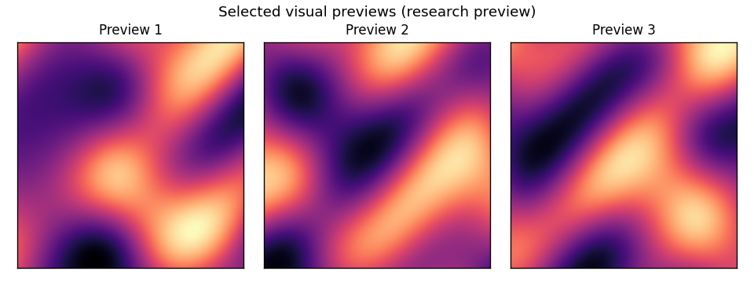
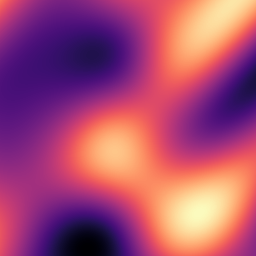

# Visual Sequence Research — Selected Preview

This repository contains selected visual previews from a **private research
prototype** exploring **structure-aware visual sequences**.

The implementation, equations, parameters, evaluation details, and source code
are not publicly released.

  

> Private implementation. Public teaser only.

## Visual preview

| Preview | Demo |
|---|---|
|  | [view MP4](media/demo1.mp4) |

## What this repository is

This is a public teaser for a private research prototype. It contains selected
public visual material only.

## What is intentionally not included

- No source code.
- No formulas.
- No technical diagrams.
- No training details.
- No evaluation tables.
- No model checkpoints.
- No private reports.
- No implementation details.

## Research status

These demos are early research previews. They are not a product, not a benchmark,
and not a state-of-the-art result.

No advantage of any kind is asserted.

## Portfolio

Part of my research portfolio → [chen-quantum.github.io/projects](https://chen-quantum.github.io/projects)

## Contact

Chen Gadi
chengadi@mail.tau.ac.il
